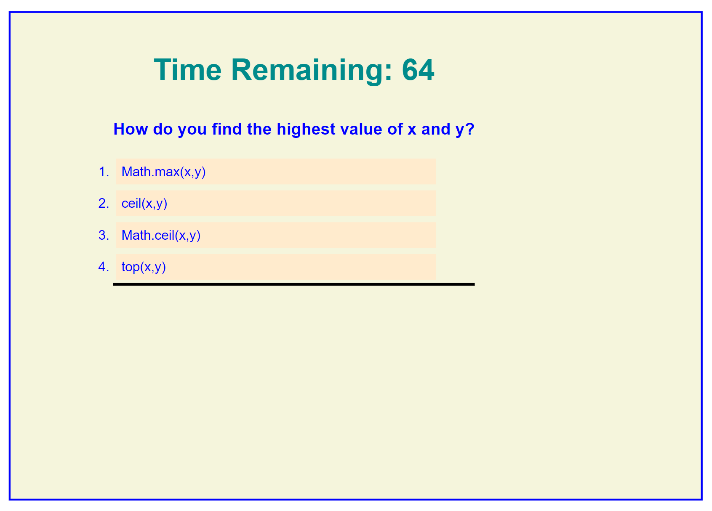
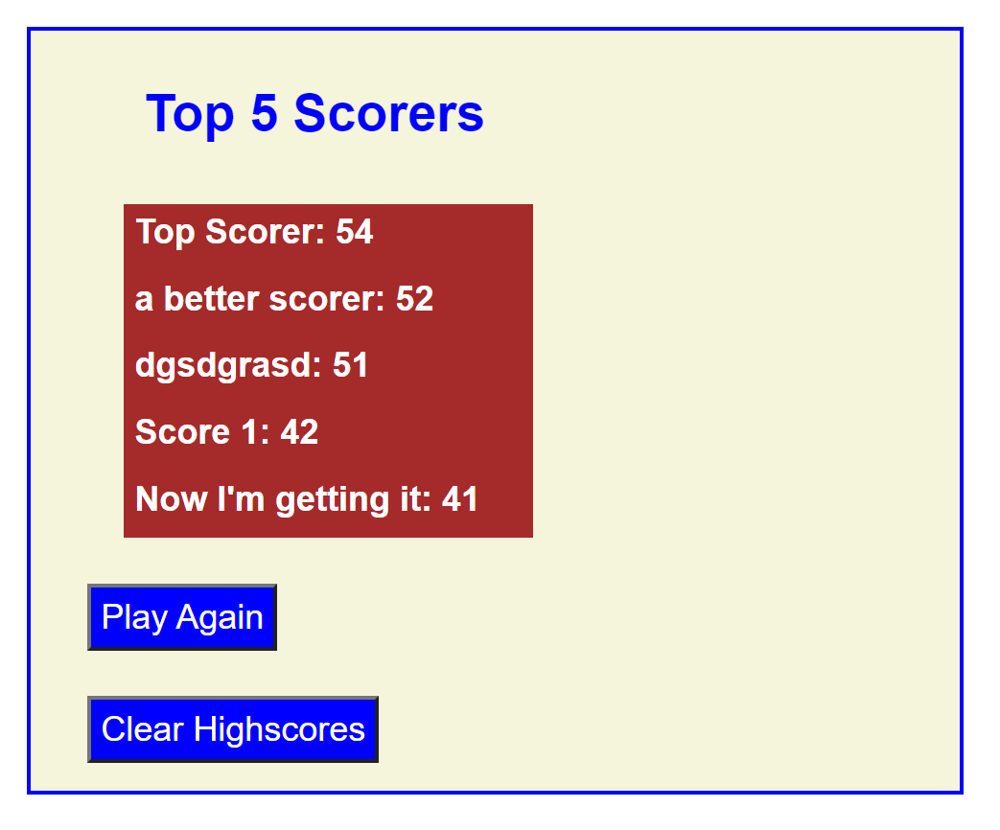

# Code-Quiz
Web page designed to test a users' knowledge of Javascript fundamentals through the one-b-yone presentation of questions under the pressure of a timer

## Description
Users will be presented with a set of questions that are designed to test their knowledge of Javascript fundamentals.
At the end of the quiz, the User will be given the opportunity to save their score.
The User will have the option to view the Highscore list, which shows the top five high scores that have been saved.

## Usage
Upon accessing the web-site, players will be able to start the quiz using the START button or to view the top five high scores by pressing the VIEW HIGHSCORES button.
If START is selected, the timer will be started and the player will be presented with the first question.  The player selects an answer and a message appears below the question to advise whether the answer was correct or incorrect.  If correct, will move on to the next question.  If incorrect, will deduct ten seconds from the timer and then move on to the next question.
Once all questions are complete, the final score will be showed (based on the time remaining) and the user will be able to enter initials and submit to save their score.
If no initials are entered, the quiz resets to the start screen. If initials are entered, the score is saved with the initials and then the quiz resets.  Values are saved across sessions using local storage.

If VIEW HIGHSCORES is selected, the top 5 highscorers will be retrieved and displayed from storage - if there are less than five scores saved, then only that number will be displayed and the title modified accordingly.
Whilst on the High scores screen, the User can choose to clear the highscores, or to return to the quiz.  In either case, once the action is complete, the quiz resets to the start screen.

The webpage is located at this address:  https://cancer2806.github.io/Code-Quiz/ and screenshot of the webpage are provided below:

CSS is contained in two files:  
  ./assets/css/reset.css is used to ensure a common start for styling
  ./assets/css/style.css is used for all other styling

JS is contained in two files: 
  ./assets/js/quiz.js holds the actual quiz questions to keep the main script.js file readable
  ./assets/js/script.js holds all the working JS code

## Credits
Repository for the submission of Week 4's Homework in UWA's Bootcamp series provided the initial questions

https://www.w3schools.com/quiztest/quiztest.asp?qtest=JS was used to fill out the remaining questions

## License
Not applicable